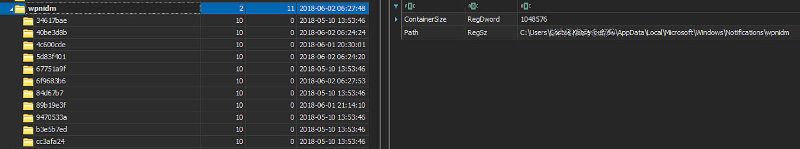
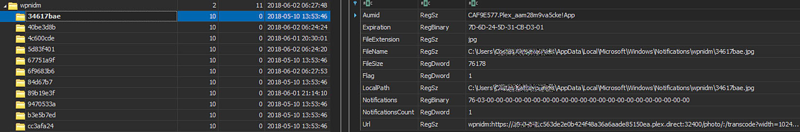
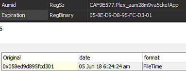

<!-- saved from url=(0059) https://kacos2000.github.io/Win10-Research/Notifications/ --> 

# Windows 10 - Notifications #

  [Notifications_WPNdatabase.sql](https://github.com/kacos2000/Win10-Research/blob/master/Notifications/Notifications_WPNdatabase.sql)  SQLite query to parse the Windows 10 Notifications Wpndatabase.
  
  
  
  #### Other Information: ####
  - Database location: C:\Users\%username%\AppData\Local\Microsoft\Windows\Notifications\wpndatabase.db  
  - Backup (settings): NTUSER.DAT: Software\Microsoft\Windows\CurrentVersion\PushNotifications\Backup  
  - Image store location: C:\Users\%username%\AppData\Local\Microsoft\Windows\Notifications\wpnidm:
  
     - NTUSER.DAT: Software\Microsoft\Windows\CurrentVersion\PushNotifications\wpnidm   
     
     - image link to application & information
     
     - image folder view
     
     - Expiration Date (Filetime):
     
