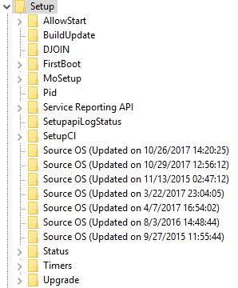

<!-- saved from url=(0044) https://kacos2000.github.io/Win10-Research/ --> 
## Windows 10 related notes/research ##

| **File**                      |**Description**
| :---:                         |     :---:    
|[Background Activity Moderator](https://github.com/kacos2000/Win10-Research/blob/master/Bam/readme.md) |  Background Activity Service and registry entries
|[PowerShell history](ConsoleHost_history.pdf) |History of PowerShell commands
|[Cortana](Cortana.pdf) |  Some notes on Cortana
|[Desktop Icon Layouts](Desktop_IconLayouts.pdf) |  List of user desktop icon/shortcuts/files (registry)
|[MS Edge Container permissions](Edge_AccessEnum_AC.xlsx) |MS Edge Access permissions
|[MS Edge Containers]('MS%20Edge%20AC.pdf') |MS Edge container info
|[USB devices](USB_device.pdf) |USB device history in the registry
|[Unix Hex to Time conversion](Unix_Hex-Time_Calc.xlsx) |Convert UNIX dates in Hexadecimal to readable DateTime
|[Windows Installation and Upgrades](Windows%20install%20date%20-%20registry.pdf) | How to determine the original Windows Installation date
|[Zone.Identifier ADS view](https://github.com/kacos2000/Win10-Research/blob/master/ads_streams/readme.md) |  PowerShell script to list Alternate Data Streams and view the Zone.Identifier ADS contents of files in a folder.  More info at [Phill Moore's blog](https://thinkdfir.com/2018/06/17/zone-identifier-kmditemwherefroms/) and at [Hacking Exposed](http://www.hecfblog.com/2018/06/daily-blog-402-solution-saturday-62318.html)
|[Windows 10 Timeline](https://kacos2000.github.io/WindowsTimeline/) |Analysis of Windows 10 (v.1803) timeline feature
|[Windows 10 EventID: 4616 parser](https://github.com/kacos2000/Win10-Research/blob/master/EventLogs/readme.md)| PowerShell script to read a live or offline **security.evtx** log and list all EventID:4616 entries *(The system time was changed)*
|[Windows 10 AmCache.hve parser](https://github.com/kacos2000/Win10-Research/blob/master/AmCache/AmCache.md)| PowerShell scripts 

