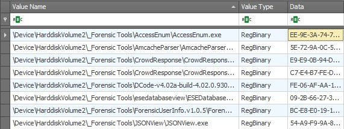
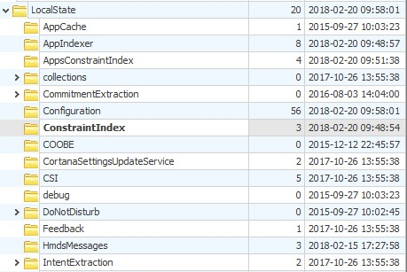
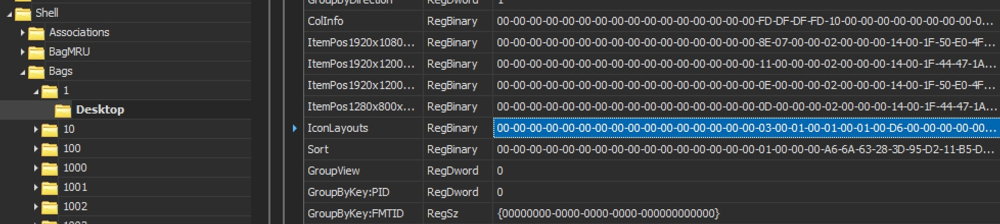
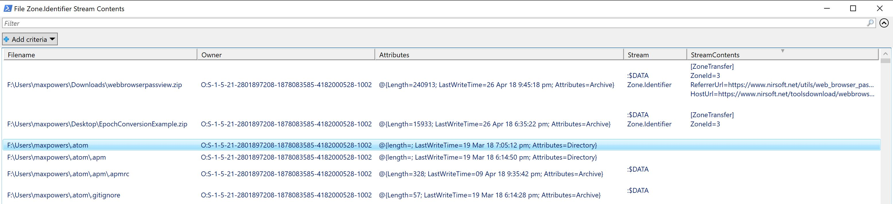

<!-- saved from url=(0023) https://github.com/kacos2000/Win10-Research --> 

## Windows 10 related notes/research

**File**|**Description**
-------------------- | ---------------------------------------------
[Windows 10 Timeline](WindowsTimeline.pdf) |  Analysis of Windows 10 (v.1803) timeline feature
[Background Activity Moderator](BAM%20-%20Background%20Activity%20Moderator.pdf) |  Background Activity Service and registry entries
[PowerShell history](ConsoleHost_history.pdf) |History of PowerShell commands
[Cortana](Cortana.pdf) |  Some notes on Cortana
[Desktop Icon Layouts](Desktop_IconLayouts.pdf) |  List of user desktop icon/shortcuts/files (registry)
[MS Edge Container permissions](Edge_AccessEnum_AC.xlsx) |MS Edge Access permissions
[MS Edge Containers]('MS%20Edge%20AC.pdf') |MS Edge container info
[USB devices](USB_device.pdf) |USB device history in the registry
[Unix Hex to Time conversion](Unix_Hex-Time_Calc.xlsx) |Convert UNIX dates in Hexadecimal to readable DateTime
[Windows Installation and Upgrades](Windows%20install%20date%20-%20registry.pdf) |How to determine the original Windows Installation date
[Zone.Identifier ADS view](streams.ps1) | PowerShell script to list the Zone.Identifier ADS contents of files in a folder

